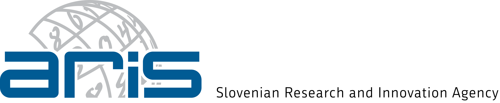

<p align="center">
  <a href="https://eriknovak.github.io/SLM4IE/"></a>
  <a href="https://cris.cobiss.net/ecris/si/sl/project/24346"></a>
  <a href="LICENSE"></a>
  <a href="https://www.python.org/downloads/"></a>
  <a href="https://docs.astral.sh/uv/"></a>
  <a href="https://docs.astral.sh/ruff/"></a></p>

SLM4IE develops small language models (SLMs) for zero-shot information
extraction across European languages, with emphasis on Slovenian. The project
targets three limitations of current LLMs:

- **Compute cost:** LLMs require infrastructure beyond reach of smaller
  organizations for local deployment
- **Low-resource gaps:** Limited training data for sensitive domains and
  underrepresented languages
- **Output inconsistency:** Unreliable structured extraction from generative
  models

We build computationally efficient models optimized for commodity hardware,
create multilingual benchmark datasets for sensitive domains, and evaluate
against existing SLMs and LLMs. All artifacts (models, datasets, code) will be
released publicly where possible.

The project website, in English and [Slovenian](https://eriknovak.github.io/SLM4IE/sl/),
is at [**eriknovak.github.io/SLM4IE**](https://eriknovak.github.io/SLM4IE/). It
covers the motivation, work packages, news and publications.

The repository is a **collection of experiments**, not a service. Each one tests
a hypothesis; the shared machinery exists to run them.
[**What we have tried and what it showed**](experiments/README.md) is the place
to start.

## Status

The project runs from March 2026 to February 2028 and is in its first year.

| Area                                                                           | State                                                  |
| ------------------------------------------------------------------------------ | ------------------------------------------------------ |
| **Experiment records**                                                         | None yet — see [`experiments/`](experiments/README.md) |
| Data pipeline: download, extract, task datasets                                | Working                                                |
| Pretraining corpus curation (eight stages)                                     | Working                                                |
| Tokenizer sweep (six backends, six metrics)                                    | Working                                                |
| Model architecture and training                                                | Planned                                                |
| Evaluation against SLMs and LLMs                                               | Planned                                                |
| Public models and datasets on [Hugging Face](https://huggingface.co/eriknovak) | Planned                                                |

How the work is organised is set out in the
[work packages](https://eriknovak.github.io/SLM4IE/work-packages/).

## Code

The code is early-stage research infrastructure: dataset preparation,
pretraining corpus curation and tokenizer comparison, with no released models or
stable interface yet. Setup instructions are in [`docs/setup.md`](docs/setup.md)
and the pipelines are documented in [`docs/`](docs/).

## Contributing

Issues and pull requests are welcome — report bugs, suggest datasets or ask
questions in [GitHub issues](https://github.com/eriknovak/SLM4IE/issues). Before
opening a pull request, run the checks:

```bash
uv run ruff check slm4ie/ scripts/ experiments/
uv run pytest -m "not slow"
```

## Citation

If you use SLM4IE in your work, please cite it. GitHub's **Cite this
repository** button, built from [`CITATION.cff`](CITATION.cff), gives APA and
BibTeX formats.

```bibtex
@software{novak_slm4ie,
  author  = {Novak, Erik},
  title   = {{SLM4IE}: Small Language Models for Zero-Shot Information Extraction in European Languages},
  url     = {https://github.com/eriknovak/SLM4IE},
  license = {Apache-2.0},
  year    = {2026}
}
```

## License

The code is released under the [Apache License 2.0](LICENSE). Datasets keep
their original licenses, which are listed per dataset in
[`docs/datasets.md`](docs/datasets.md); the pipeline downloads them from their
sources rather than redistributing them.

## Contact

SLM4IE is led by [dr. Erik Novak](https://cris.cobiss.net/ecris/si/sl/researcher/50358)
at the [Department of Artificial Intelligence](https://ailab.ijs.si/),
[Jožef Stefan Institute](https://www.ijs.si/), in partnership with
[Event Registry](https://eventregistry.org/). Contact:
[erik.novak@ijs.si](mailto:erik.novak@ijs.si).

## Acknowledgments

<p align="center">
  <picture>
    <source media="(prefers-color-scheme: dark)" srcset="./website/assets/imgs/aris_dark.png">
    
  </picture>
</p>
<p align="center">
  Funded by <a href="https://www.aris-rs.si/">ARIS</a>, the Slovenian Research and Innovation Agency,<br>
  under project number <a href="https://cris.cobiss.net/ecris/si/sl/project/24346">Z2-70067</a>.
</p>
