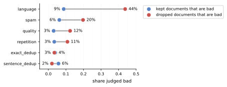
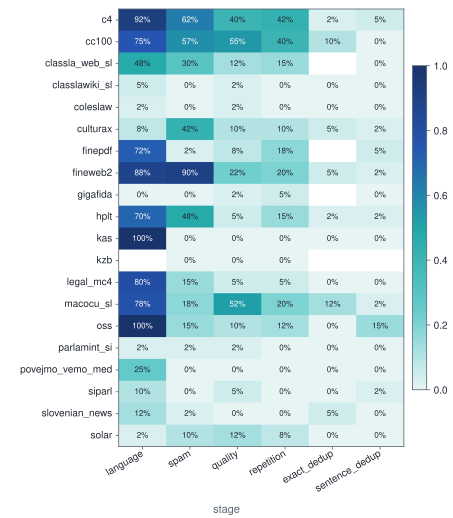
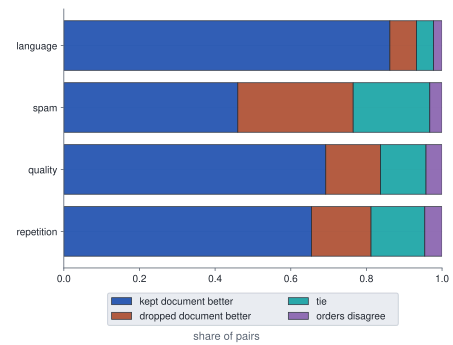
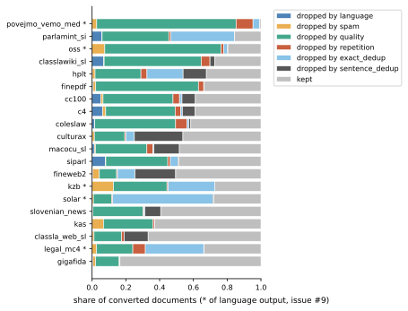
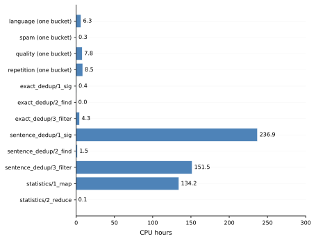

# Curation pipeline quality — Slovenian

## TL;DR

- **Hypothesis**: refuted (concluded 2026-09-30) — the pipeline keeps clean text, but every content filter drops mostly good text, and the medical and scientific sources lose most of theirs to a quality filter built for web crawls. Every judged number comes from a judge run that agrees with a person less closely than the record's gate asks ([F12], the two judge runs).
- **F1 — Every content filter drops mostly text worth keeping.** More than half of what each content filter drops is text the judge would keep.
- **F2 — A filter's precision depends heavily on the source.** The spam filter drops mostly real spam on the fineweb2 web crawl and almost nothing but good text on every curated source.
- **F3 — What the stages keep is clean.** Fewer than one in ten documents that any stage keeps is bad text at the lenient bar.
- **F7 — Curated domain sources lose most of their text to a filter the judge does not confirm.** The quality filter removes most of the medical source, and the judge calls none of the sampled drops bad text.
- **Next**: the planned threshold experiment, curation-thresholds-slovenian, tunes the filters per source and validates on a fresh, held-back draw.

## Hypothesis

- **Statement**: The eight-stage curation pipeline removes low-quality records without discarding valid domain-specific text; each stage's drop rate is explained by its intended filter, not by domain or source artefacts.
- **Rationale**: the pipeline's filters were built for English web text, and nobody had checked its drops against labels.
  - **The stages were tuned on English web crawls.** They are Gopher-style heuristics and cross-corpus dedup, both designed for English web text.
  - **An earlier build already lost most of its documents.** The first build lost 30 M of 54 M documents in sentence dedup alone. The quality filter's cap on lines ending in an ellipsis dropped Slovene news articles wholesale, showing one default already misfiring on Slovene prose.
  - **No label had checked the drops.** Whether the rest of the drops are correct had only been judged by intuition.
- **Predictions**: each clause is tested on the stratified sample against the calibrated judge. The thresholds are unchanged since first written.
  - **H1 — Each stage mostly drops bad text**: confirmed if every stage's precision of drops is at least 0.8; refuted if any stage drops mostly good text (precision below 0.6 overall) — the filters would be removing what they should keep.
  - **H2 — No source is mistreated by a stage**: confirmed if no source has a stage precision below 0.6; refuted otherwise — the filters would suit some sources and not others.
  - **H3 — What survives is clean**: confirmed if the residual bad rate among kept documents is below 0.1 on every judged dimension; refuted otherwise — bad text would pass the filters.
  - **H4 — Curated domain text survives**: confirmed if no curated domain source (medical, scientific, legal) loses more than half its documents to a stage whose drops the judge does not confirm; refuted otherwise — domain text would be lost to filters not built for it.
  - **Verdict rule**: confirmed when all four clauses hold; refuted when any clause is refuted; inconclusive otherwise.
- **Outcome**: refuted

## Design

- **Inputs**: every extracted Slovene source except two benchmark corpora ([D1], the sources in the rerun), curated by `configs/data/curate.yaml`. From the curated corpus come the judged sample, the pairwise drawing and two sets of hand labels, described in `## Datasets`.
- **Method / factors**: one pass through the curated corpus and its judged sample.
  - Rebuild the corpus through the eight-stage curation pipeline ([M1]).
  - Draw kept and dropped documents for every source and deciding stage ([M2]).
  - Judge each drawn document on a seven-property rubric, blind to the stage and decision ([M3]).
  - Measure how far the judge agrees with a person on keep or drop ([M4]).
  - Score each stage's drops and keeps against the judge ([M5]).
  - Ask the judge to choose between a kept and a dropped document ([M6]).
  - Check whether each dedup drop's content survives as another copy ([M7]).
  - Have a person settle the cases where judge and pipeline conflict ([M8]).
  - Describe the corpus without a judge: survival, domains, licences, vocabulary ([M9]).
  - Read the processor time of every pipeline step ([M10]).
  - Factors: none. This is an assessment, and the repairs it motivates belong to the threshold experiment ([D6], measure rather than tune).
- **Metrics**: primary drop precision per stage and source, at the lenient bar with the strict bar beside it ([D8], the bad-text bar). Secondary: residual bad rate, kept win rate, Cohen's κ between judge and person, side-with-judge share, twin match rate, and the corpus statistics that need no judge. Throughput is CPU hours per step. Two planned metrics were not measured: the near-duplicate rate among kept documents and sentence-dedup drops by reason. Each metric is defined in `experiments/GLOSSARY.md`.
- **Protocol**: one corpus build, tracked in MLflow under `slm4ie/data/curate`. The sample seed is fixed at 20260916 and the adjudication seed at 20260930. The judge ran once over the sample, and its agreement gate was read on a separate calibration run ([D5], the calibration gate). A fresh draw stays unjudged for the tuning experiment ([D10]). Everything after the build is analysis-only: `analysis.py` recomputes every table and figure from the data files.
- **Compute**: one local machine with 40 cores, 125 GB of memory and 6.4 TB free on `/vault`. The SLING cluster stayed an unused fallback ([D7]).
- **People**: the project lead labelled 116 calibration and 29 adjudication documents in a notebook, a few hours in all.
- **Data access**: four sources are licence-restricted (culturax, gigafida, kas, solar). They are used internally and counted apart from what a public release could hold ([D1]).
- **External dependency**: Anthropic's Claude models, Sonnet 5 for the rubric and Opus 5 for the pairwise pass, through the Batch API and the Claude Code command line ([D3], the judge's backends).

## Datasets

- **Curated corpus**: the pretraining corpus the pipeline builds from 20 Slovene sources, one row per source with its domain, kind, licence and size before and after curation. Built 2026-09-16, finishing at commit a63399d. [Sources of the curated corpus, before and after curation](tables/dataset-corpus-statistics.csv)
- **Judged sample**: kept and dropped documents drawn per source, stage and decision, each cut to its opening characters for the judge ([D2], the judged unit). Its verdicts, with their domain labels, are frozen under `final/`. [The judged sample per stage and decision](tables/dataset-sample-statistics.csv)
- **Pairwise drawing**: pairs of one kept and one dropped document from the same source and content filter, each asked in both orders. [The pairwise drawing per stage](tables/dataset-pairs-statistics.csv)
- **Hand labels**: the calibration labels, on the first part of a calibration set drawn round-robin from the sample and labelled in id order, and the adjudication labels, on conflicts from the sources the calibration missed. Both use the judge's rubric and are frozen under `final/`. [The two sets of hand labels](tables/dataset-labels-statistics.csv)

## Methods

### M1 — Rebuild the corpus through the eight-stage curation pipeline

- **Input**: every source's extracted file under `data/extracted/`, one document per row with its text, source and domain. The two benchmark corpora are left out ([D1]).
- **Output**: the curated corpus under `data/pretrain/`, one folder per stage. Each per-source stage writes a sentinel file with the documents it read and wrote, and the build is one MLflow run.
- **How**: the eight stages run in this order. The first five, convert to repetition, run once per group of sources that share settings; the last three run once over the whole corpus.
  1. Convert each source into the pipeline's document shape.
  2. Drop documents the lingua language identifier does not call Slovene (the language filter).
  3. Drop documents that reach a count of words from the project's Slovene adult and spam word lists (the spam filter).
  4. Drop documents failing the Gopher quality heuristics (the quality filter).
  5. Drop documents failing the Gopher repetition heuristics (the repetition filter).
  6. Drop byte-identical copies across the corpus (exact dedup).
  7. Remove three-sentence windows seen elsewhere, and drop documents left too short (sentence dedup).
  8. Compute per-source statistics of the finished corpus.
- **Code**: `slm4ie/data/curate/runner.py::curate`
- **Settings**: `spam.min_adult_hits` (adult-word occurrences that drop a document, 2), `spam.min_spam_hits` (spam-word occurrences that drop a document, 2), `quality.min_doc_words` (shortest document the quality filter keeps, 20 words), `sentence_dedup.n_sentences` (sentences per window, 3) and `sentence_dedup.min_doc_words` (shortest document sentence dedup keeps, 50 words), in configs/data/curate.yaml

### M2 — Draw kept and dropped documents for every source and deciding stage

- **Input**: each deciding stage's input and output shards in the curated corpus ([M1]).
- **Output**: `interim/sample.jsonl`, one row per document with its source, the stage-and-decision cells it was drawn into, and its opening characters.
- **How**:
  1. For each source and stage, read the stage's output once, keeping a seeded sample of kept documents and an index of every surviving id.
  2. Search a seeded random subset of the stage's input shards, the compressed files a stage writes its documents into, for documents the index lacks. Those are the drops, and a sample of them is kept. Drops are therefore drawn from a few files per source, not from all of them.
  3. Merge rows by document id, so a document kept by one stage and dropped by the next counts in both cells.
- **Code**: `slm4ie/data/curate/sample.py::draw_stratified_sample`
- **Settings**: `--per-cell` (documents per source, stage and decision, 40), `--shards-per-cell` (input shards searched for drops, 3), `--max-chars` (characters kept per document, 2,000), `--seed` (fixes the draw, 20260916), flags of the sample subcommand of curate_pretraining_corpus.py

### M3 — Judge each drawn document on a seven-property rubric

- **Input**: the drawn documents ([M2]) and the rubric prompt `experiments/data/curation-quality-slovenian/configs/judge-rubric.md`.
- **Output**: `interim/verdicts-full-sonnet.jsonl`, one verdict per document: language, text type, coherence from 1 to 5, domain, and yes-or-no flags for adult or spam, machine translation and personal data.
- **How**: documents go to the judge in groups, each shown by id and text only, never with its stage or decision. Every reply is checked against a schema, and a group whose reply fails is judged again. Documents already judged are skipped on a rerun.
- **Code**: `slm4ie/data/judge.py::judge_documents`
- **Settings**: `--model` (the judging model, Sonnet 5), `--backend` (Batch API or command line; the command line here), `--batch-size` (documents per request, 10), flags of scripts/judge_documents.py

### M4 — Measure how far the judge agrees with a person on keep or drop

- **Input**: the calibration set of 300 documents, drawn round-robin across the sample's cells but labelled in id order, so the person's first 116 labels reach 8 sources. Two judge runs cover it, the calibration run and the full-sample run ([M3]).
- **Output**: `tables/calibration-agreement.csv`, one row per judge run against the person and one for the runs against each other.
- **How**:
  1. The person labels documents in a notebook on the judge's rubric, seeing the judge's verdict only after saving.
  2. Both raters' labels collapse to keep or drop by the bad-text bar ([D8]).
  3. Cohen's κ and raw agreement are taken at both bars, and coherence agreement exactly and within one point.
- **Code**: `experiments/data/curation-quality-slovenian/analysis.py::agreement_rows`
- **Settings**: `--calibration-verdicts` (the judge run the gate is read on), a flag of `analysis.py`

### M5 — Score each stage's drops and keeps against the judge

- **Input**: the drawn documents ([M2]) and their verdicts ([M3]).
- **Output**: `tables/stage-decisions.csv` pooled over sources and `tables/source-stage-decisions.csv` per source.
- **How**:
  1. Group the verdicts by source, stage and decision; a document drawn into two cells counts in both.
  2. For each stage, pooled and per source, take drop precision as the share of dropped documents that are bad text, and the residual bad rate as that share among kept documents. Pooling adds up the equal-sized cells, so every source weighs the same whatever its size.
  3. Score both at the lenient and the strict bar; at the language filter, text the judge does not call Slovene also counts as bad ([D8]).
  4. Attach a 95% Wilson interval to each share, and leave blank a cell the sample never reached.
- **Code**: `experiments/data/curation-quality-slovenian/analysis.py::stage_rows`
- **Settings**: none

### M6 — Ask the judge to choose between a kept and a dropped document

- **Input**: the drawn documents ([M2]) and the pairwise prompt `experiments/data/curation-quality-slovenian/configs/judge-pairwise.md`.
- **Output**: the drawing `interim/pairwise-opus.pairs.jsonl`, the answers `interim/pairwise-opus.jsonl`, and `tables/pairwise-outcomes.csv`.
- **How**:
  1. Pair kept and dropped documents of the same source and stage at random, with a fixed seed.
  2. Ask the judge for the better document twice, with the two swapped. The drawing records which slot held the kept document; the prompt never says.
  3. A pair counts for the kept document, the dropped one or a tie only when both orders agree; otherwise the orders differ.
- **Code**: `slm4ie/data/judge.py::judge_pairs`
- **Settings**: `--pairs-per-cell` (pairs per source and stage, 20), `--stages` (stages paired, the four content filters), `--model` (the judging model, Opus 5), flags of scripts/judge_documents.py with the pairwise task

### M7 — Check whether each dedup drop's content survives as another copy

- **Input**: the sampled dedup drops ([M2]), with their full text re-read from the stage's input; the exact-dedup output and the finished corpus ([M1]).
- **Output**: `tables/dedup-twins.csv` per stage, the unmatched drops in `interim/dedup-unmatched.jsonl`, and their judged quality in `tables/dedup-lost-text.csv`.
- **How**:
  1. Hash each drop's whole text and every window of three sentences.
  2. Scan the exact-dedup output for documents sharing the text hash or any window; the best twin shares the most windows.
  3. An exact-dedup drop is matched when an identical twin exists, a sentence-dedup drop when a twin holds at least the coverage floor of its windows. Either way the twin must reach the finished corpus. Only the best twin is checked, so a drop whose other copies survive is counted as lost.
  4. Score the unmatched drops against their judge verdicts.
- **Code**: `slm4ie/data/curate/duplication.py::assess_dedup`
- **Settings**: `--coverage-floor` (share of windows a twin must hold, one half), flags of the duplication subcommand of curate_pretraining_corpus.py

### M8 — Have a person settle the cases where judge and pipeline conflict

- **Input**: the drawn documents ([M2]), their verdicts ([M3]), and the sources the calibration labels already reach.
- **Output**: the drawn conflicts `interim/adjudication.jsonl`, the person's labels frozen in `final/human-labels-adjudication.jsonl`, and `tables/adjudication.csv`.
- **How**:
  1. A conflict is a content filter dropping text the judge calls clean even at the strict bar, or keeping text it calls bad at the lenient bar. Dedup drops are left out, because a duplicate is not bad text ([D9]). The person's call is then read at the lenient bar, the one the findings use.
  2. Draw only from sources the calibration labels never reached, round-robin by source and conflict direction with a fixed seed.
  3. The person labels them blind to judge and pipeline, and the share siding with the judge is reported with a Wilson interval.
- **Code**: `experiments/data/curation-quality-slovenian/analysis.py::draw_adjudications`
- **Settings**: `--draw-adjudications` (conflicts to draw, 30), a flag of analysis.py; the seed is fixed at 20260930

### M9 — Describe the corpus without a judge

- **Input**: the stage sentinels and the exact-dedup output of the curated corpus ([M1]), its statistics stage, `configs/data/extract.yaml` for each source's licence, and the Sloleks lexicon.
- **Output**: `tables/source-funnel.csv`, `tables/source-losses.csv`, `tables/domain-mix.csv`, `tables/gated-totals.csv` and `tables/corpus-profile.csv`.
- **How**:
  1. Count every source's documents after exact dedup, and profile a sample of every source in the finished corpus.
  2. Build each source's survival funnel from the sentinels and those counts. The share lost at each stage is taken over the converted documents. Five sources left the language filter doubled, because an earlier run's output files stayed beside the new ones; their shares are taken over the language filter's output instead.
  3. Total documents and words by domain and by licence from the statistics stage.
  4. The profile reads every tenth document of each source's first three files, up to the per-source count, and reports length percentiles, type-token ratio at a fixed token budget, out-of-vocabulary rate against Sloleks, and language-identification confidence.
- **Code**: `slm4ie/data/curate/profile.py::describe_corpus`
- **Settings**: `--per-source` (documents profiled per source, 2,000), `--sloleks` (the lexicon file), flags of the describe subcommand of curate_pretraining_corpus.py

### M10 — Read the processor time of every pipeline step

- **Input**: the executor logs of the curated corpus's build, `data/pretrain/_logs/`, one statistics file per task.
- **Output**: `tables/throughput.csv`, one row per step.
- **How**:
  1. Skip task files whose number exceeds the step's task count; an earlier, larger run in the same folder left them.
  2. Take each task's duration as its slowest pipeline block, since a block's timer stays open while later blocks consume its output.
  3. Take each task's end from its statistics file's timestamp. The step starts at the earliest of the tasks' ends minus their own durations.
  4. Mark the per-source stages as covering one group of sources, since each group overwrites the previous group's logs.
- **Code**: `experiments/data/curation-quality-slovenian/analysis.py::throughput_rows`
- **Settings**: none

## Decisions

### D1 — Rerun every extracted source except the two benchmark corpora

- **Decision**: All extracted sources except the benchmark corpora suk and ssj500k. The four licence-restricted sources stay in, flagged by licence, so totals can be reported with and without them.
- **Why**: Benchmarks inside the pretraining corpus contaminate evaluation. Licence-restricted sources are real training material for an internal model, but a public release cannot include them, so the project's corpus-size target needs both totals.
- **Alternatives**:
  - Rerun every source as before: keeps the benchmark leak.
  - Drop the licence-restricted sources too: loses the internal-model total.
- **History**:
  - 2026-09-14 first version, grill Q15

### D2 — Judge each document's opening, and kept-against-dropped pairs per source

- **Decision**: Two units. For the rubric, a document's first 2,000 characters, 40 per source, stage and decision, drawn with a fixed seed. For the pairwise pass, one kept against one dropped document of the same source and stage, 20 pairs per source and content filter, asked in both orders.
- **Why**: The Gopher filters decide on surface statistics, so the opening characters carry the evidence and bound the judge's tokens. Forty per cell gives about ±15 points of precision, enough to read one source at one stage. A forced choice needs no shared rating scale.
- **History**:
  - 2026-09-14 first version, grill Q21
  - 2026-09-17 raised from 15 to 40 per cell; the funnel from the finished build showed per-source stage drops worth reading individually (medical loses 85% at `quality`), and 10,000 documents is within the judge budget
  - 2026-09-25 pairwise unit added, per source rather than pooled. Absolute scales proved unreliable between annotators — human and judge matched on only 39.7% of the 1-5 coherence scale — while a forced choice between two documents needs no shared scale at all. Per-source draws are what the prediction "no source below 0.6" is actually about; 20 sources × 4 stages × 20 pairs × 2 orders is roughly 3,200 comparisons, about $4 on the Batch API
  - 2026-09-29 pairwise pass run through the command-line backend on Opus 5, a different model from the rubric pass's Sonnet 5, so the two readings are never averaged

### D3 — Run the judge as a resumable script with two backends

- **Decision**: A standalone script with two backends: the Batch API, at half price with the reply shape enforced by a schema, and the Claude Code command line, which needs no API key. Model, prompt, group size and request cap are settings, and judged documents are skipped on rerun.
- **Why**: A separate script bounds token use and resumes after a failure, which subagents inside a session cannot. Grouping documents per request spreads the rubric's cost over many verdicts. Prompt caching is not used, because the rubric is shorter than the minimum cacheable prefix.
- **Alternatives**:
  - Session subagents: no cap, no resume.
  - Local open model: weaker on Slovene, no calibration evidence.
- **History**:
  - 2026-09-14 first version, grill Q17/Q21
  - 2026-09-18 Batch API added as the default backend and the command line kept as the second; the whole 8,930-document run costs about $5 on Haiku 4.5 or $10 on Sonnet 5, so the model is chosen by the κ gate rather than by cost
  - 2026-09-30 the full-sample run went through the command line and the calibration run through the Batch API; their agreement with the person differs ([F12])

### D4 — Label seven properties per document, blind to its stage

- **Decision**: Per document: language, text type (prose, boilerplate, list, code, garbage), adult or spam, coherence from 1 to 5, machine-translated, personal data, and domain from the catalogue's taxonomy. The judge sees the id and text only, never the stage or decision. The rubric is `experiments/data/curation-quality-slovenian/configs/judge-rubric.md`.
- **Why**: Each stage targets one of these properties, so each stage can be scored on its own. The domain label doubles as gold for a planned domain classifier. For the stage metrics the properties collapse to keep or drop by the bad-text bar ([D8]).
- **History**:
  - 2026-09-14 first version, grill Q12/Q16
  - 2026-09-17 domain vocabulary aligned with `configs/data/extract.yaml` so a judged label can be compared against the source's declared domain; blindness written into the rubric

### D5 — Trust the judge once it agrees with a person on keep or drop

- **Decision**: The project lead labelled 116 calibration documents blind to the judge. The gate is Cohen's κ of at least 0.6 on the keep-or-drop decision at the lenient bar. The calibration run of the judge meets it; the full-sample run the findings use falls short ([F12], the two runs).
- **Why**: The pipeline makes one binary decision, so that is the judgement the judge must be trusted on. Agreement on the 1-5 coherence scale and the domain was far lower than on keep or drop. A κ of 0.6 is the conventional floor for substantial agreement.
- **History**:
  - 2026-09-14 first version, grill Q22
  - 2026-09-18 weighted κ adopted for coherence after Haiku and Sonnet agreed on only 52% of the 1-5 scale while 98% of their disagreements were a single point, and one model pairing, Sonnet 5 against Haiku 4.5, differed on 87 of the 280 documents both judged; the coherence anchors were rewritten as an ordered decision with an explicit 4/5 test
  - 2026-09-22 briefly cut to 100 documents for the labeller's time, then restored to 300 the same evening; the smaller set would have carried a κ interval of about ±0.15 against ±0.09 on 300
  - 2026-09-25 gate rewritten onto the collapsed decision after 116 labels showed the first gate, which required agreement on each of the seven rubric properties separately, was unreachable by construction; labelling stopped at 116 rather than 300 (grill round 1, Q4). Coherence agreed exactly on 39.7% and the domain on 69%, against 94.0% on keep or drop
  - 2026-09-25 the 116 fell in file order and so reached only 8 of 20 sources, all web-derived; agreement on curated prose was left to the adjudications ([F5])
  - 2026-09-30 the 30 adjudications drawn across the twelve unreached sources, interleaved so a partial round still covers each; 29 labelled ([F5])
  - 2026-09-30 found that the gate was read on the calibration run (κ 0.66) while every finding uses the full-sample run (κ 0.43 on the same 116); kept as a stated limitation rather than re-judging, at the project lead's call ([F12])

### D6 — Measure the pipeline, do not tune it

- **Decision**: No stage threshold is varied.
- **Why**: The hypothesis is about whether the current pipeline is trustworthy; varying floors would turn it into a tuning study with a different hypothesis.
- **History**:
  - 2026-09-14 first version, grill Q27; sentence-dedup drops were to be logged by reason as the tuning experiment's baseline
  - 2026-09-25 reaffirmed once the audit showed the content filters drop mostly usable text: the repairs that finding calls for go to `curation-thresholds-slovenian`, which varies the dials and validates on a fresh draw ([D10])
  - 2026-09-30 logging sentence-dedup drops by reason was never built; it moves to the tuning experiment

### D7 — Build locally, moving a stage to the SLING cluster only if it cannot fit

- **Decision**: Run locally with workers sized to the machine and resource use monitored; move a stage to the SLING cluster only if it cannot fit in memory or disk.
- **Why**: The first build completed locally; the rerun differs only by excluding two small sources. SLING is available for one year if needed.
- **History**:
  - 2026-09-14 first version, grill Q24

### D8 — Count text as bad by coherence, shape and spam, fixed before the metrics

- **Decision**: Bad text is coherence 2 or less, garbage or boilerplate, or adult or spam: the lenient bar, primary for every metric. The strict bar adds coherence 3 and is reported beside it. At the language filter, text the judge does not call Slovene is also bad.
- **Why**: Every precision number moves with this line, so it was fixed before the results. The lenient bar is the one the person's labels calibrate best. The language rule is that filter's own purpose, which the rest of the bar never looks at.
- **History**:
  - 2026-09-25 first version, grill round 2 Q1; κ with the person 0.66 at the lenient bar against 0.47 at the strict
  - 2026-09-30 language rule added at the project lead's call after a cold read found the bar counted the language filter's correct drops of other languages as mistakes; it raises that filter's drop precision and changes no clause's verdict ([F1])

### D9 — Assess dedup by whether a dropped document's content survives

- **Decision**: Duplication statistics first. Every sampled dedup drop is matched against the corpus: by identical text for exact dedup, by sharing at least half its three-sentence windows for sentence dedup. It counts as matched only if that twin reaches the finished corpus. The judge reads only the drops left unmatched.
- **Why**: Judging quality cannot see a dedup stage's mistakes, since what it removes is copies of good text. Among judged documents, dedup's dropped text scored as usable as its kept text, or more so. A stage that removes duplicates can only be judged on whether what it removed was duplicated.
- **History**:
  - 2026-09-25 first version, grill round 2 Q3; exact dedup's kept and dropped text was usable at 96.1% against 96.6%, sentence dedup's at 94.2% against 98.0%
  - 2026-09-30 MinHash replaced by three-sentence windows, the unit sentence dedup itself removes, so the match asks the stage's own question; the survival check added once exact twins were found removed later by sentence dedup ([F6])

### D10 — Hold back a fresh draw for validating any tuning

- **Decision**: The tuning experiment may use the judged documents and the hand labels to choose thresholds, but no claim of improvement rests on them. It draws a fresh sample under a new seed, judged only once thresholds are frozen, and confirms with a judge from another model family.
- **Why**: Thresholds tuned against one judge's verdicts stop being neutral evidence, since the pipeline would be fitted to that judge's taste on those documents. A fresh draw controls for the documents, and a second judge controls for the judge.
- **History**:
  - 2026-09-25 first version, grill round 2 Q4

## Findings

### F1 — Every content filter drops mostly text worth keeping · key

- **Summary**: More than half of what each content filter drops is text the judge would keep.
- **Runs**: no runs; `analysis.py` at daeba94 over the judged stratified sample (Sonnet 5 rubric verdicts)
- **Result**:  Each row is one stage. The red dot is drop precision, the share of its dropped documents that are bad text, and the blue dot is the residual bad rate among what it keeps, both at the lenient bar. The intervals and the strict bar are in the stage table under the finding on kept text.
- **Reading**:
  - **Drop precision is low at every content filter.** It falls from under half of drops at the language filter, where text in other languages counts as a correct drop, to about a tenth at the repetition filter. The strict bar, one coherence point stricter, raises every stage but leaves each short of the clause's bar.
  - **[H1] is refuted.** The clause fails if any stage's drop precision, pooled over sources, is below 0.6, and every content filter is below it at both bars. The dedup stages are lower still, but they remove copies rather than bad text, so they are read by whether a copy survives ([F6]).
  - **Only a judge that calls bad text good would overturn this.** The run behind these numbers agrees with the person less closely than the calibration run did. Even correcting for its errors at their worst, three of the four filters stay below the clause's bar ([F12], the two judge runs).
- **Implication**: Both the thresholds and the filters' design need changing: the spam filter's counting rule is a design fault ([F2]). The planned threshold experiment, curation-thresholds-slovenian, tests the changes and confirms them on a fresh, held-back draw ([D10]).
- **History**:
  - 2026-09-29 first result, rubric pass over 8,930 documents at both bars
  - 2026-09-30 language filter rescored with other languages counted as a correct drop ([D8]), raising its drop precision from 33% to 44%

### F2 — A filter's precision depends heavily on the source · key

- **Summary**: The spam filter drops mostly real spam on the fineweb2 web crawl and almost nothing but good text on every curated source.
- **Runs**: no runs; `analysis.py` at daeba94 over the judged stratified sample
- **Result**:  Blank cells are source and stage pairs the sample never reached. Most coloured cells rest on 40 dropped documents, so a cell's 95% interval spans about fifteen points either way.
- **Reading**:
  - **Raw web crawls get their drops right far more often than curated sources.** The high cells sit on crawls such as c4, cc100, hplt and fineweb2. The parliamentary transcripts (parlamint_si, siparl), the medical source (povejmo_vemo_med) and the edited reference corpora (gigafida, kas) sit at or near zero at every content filter.
  - **[H2] is refuted.** The clause needs every source to reach 0.6 at every stage, and most sources fall below it at most stages. The spam filter shows why: it counts every occurrence of a lexicon word, so a repeated ordinary word triggers it. One such word is *replika*, a rebuttal in parliamentary debate.
  - **Neither sampling noise nor the judge run explains the zeros.** Forty drops with no bad text among them put the true rate under about 9%. The judge run sits below the agreement gate ([F12]), but its errors would have to fall on curated sources alone to erase the gap. The cells of coleslaw, a collection of Slovene legal texts, undercount its drops, because that source repeats document ids and the sampler recovers drops by id.
- **Implication**: A per-source switch for each stage would let curated sources skip filters built for web crawls. The pipeline already groups sources by their settings, so the switch is small.
- **History**:
  - 2026-09-29 first result; spam-lexicon mechanism read from the sampled clean drops the same day
  - 2026-09-30 language column rescored under the language rule of the bad-text bar ([D8]); raw crawls such as c4 and fineweb2 rise above 0.6 there, curated sources stay near zero

### F3 — What the stages keep is clean · key

- **Summary**: Fewer than one in ten documents that any stage keeps is bad text at the lenient bar.
- **Runs**: no runs; `analysis.py` at daeba94 over the judged stratified sample
- **Result**: [Drop precision and residual bad rate per stage at both bars, with 95% Wilson intervals](tables/stage-decisions.csv)
- **Reading**:
  - **Every stage's kept documents are mostly clean.** The residual bad rate runs from under a twentieth at the quality and repetition filters to under a tenth at the language filter.
  - **[H3] is confirmed at the lenient bar, fixed as primary before any result ([D8]).** The rubric's properties collapse to that one call, as the labelling decision set out ([D4]). At the strict bar up to a quarter of kept text counts as bad. Per source, one crawl's language filter keeps more (c4, 27.5%), a question for [H2].
  - **The rate is likely an overestimate on curated sources.** Where the judge calls kept text bad there, a person agrees less than half the time ([F5], the adjudication). The judge run behind it also sits below the agreement gate ([F12]).
- **History**:
  - 2026-09-29 first result at both bars

### F4 — Asked to choose, the judge prefers the dropped document most often at the spam filter · supporting F1

- **Summary**: Shown one kept and one dropped document side by side, the judge prefers the dropped one in nearly a third of all spam-filter pairs.
- **Runs**: no runs; `analysis.py` at daeba94 over the pairwise pass (Opus 5)
- **Result**:  A pair counts for one side only when the judge gives the same answer with the two documents in both orders. Per-source counts are in `tables/pairwise-outcomes.csv`.
- **Reading**:
  - **The forced choice agrees with the rubric that the language filter is the most accurate, and ranks the spam filter last.** By drop precision the rubric orders the content filters language, spam, quality, repetition ([F1]). By how rarely the dropped document wins, the forced choice orders them language, quality, repetition, spam. The two differ on spam because a forced choice asks whether the dropped text is better, not only whether it is bad.
  - **Dropped text is often as good as kept text, which supports the drop-precision result ([F1]) from a second angle.** A forced choice needs no shared 1-5 scale, the weakest part of the rubric. A different model gave it, so the reading does not rest on one judge's calibration.
  - **Position bias would overturn it, and there is little.** Swapping the two documents changes the answer in under one pair in twenty, so the outcome reflects the documents rather than their order.
- **History**:
  - 2026-09-29 first result, 1,549 pairs asked in both orders

### F5 — A person confirms the judge on drops but not on keeps · supporting F1

- **Summary**: On sources the calibration never reached, a person sides with the judge on most conflicting drops but on only 5 of 11 conflicting keeps.
- **Runs**: no runs; `analysis.py` at daeba94 over the adjudication labels
- **Result**: [Share of judge and pipeline conflicts where a person sides with the judge](tables/adjudication.csv)
- **Reading**:
  - **The drops the judge calls good text are good text.** Labelling blind to both judge and pipeline, the person sided with the judge on 14 of 18 such drops. Agreement beyond chance cannot be computed here, since every document was drawn because the two disagree.
  - **It extends the calibration behind the drop-precision result ([F1]) to curated sources.** It also qualifies the clean-keeps result ([F3]). There the judge called a parliamentary floor formula, thesis metadata and study notes bad text, where the person kept them.
  - **Twenty-nine documents bound this loosely.** Each interval spans about thirty points either way. Most of the conflicting drops would have to reverse before the judge's reading of the drops could be doubted.
- **History**:
  - 2026-09-30 first result, 29 of 30 drawn conflicts labelled by the project lead

### F6 — Dedup removes real copies, yet some text leaves no copy behind · supporting F1

- **Summary**: Nearly every document the dedup stages drop has a copy, but two in five sentence-dedup drops leave no surviving document holding half their text.
- **Runs**: no runs; `curate_pretraining_corpus.py duplication` at 48d129d, then `analysis.py` at daeba94
- **Result**: [Dropped documents with a twin, and with a twin that reaches the finished corpus, per dedup stage](tables/dedup-twins.csv)
- **Reading**:
  - **The two dedup stages compound.** Exact dedup drops byte-identical copies, but sentence dedup later removes some of the copies it kept. A document dropped as a duplicate can so end with no copy at all, which neither stage's own counts show.
  - **The lost text is good text, so dedup adds to the loss behind [F1].** Of the 369 sampled dedup drops with no surviving twin, from both stages, almost all pass the judge's bar. They fall hardest on the parliamentary sources, where speeches legitimately repeat procedural phrases.
  - **Two effects may overstate the loss.** Only each drop's best twin is checked for survival, so a drop whose other copies survive counts as lost. Also, five sources left the language filter doubled (kzb, legal_mc4, oss, povejmo_vemo_med, solar), because a rerun left old output files beside new ones. Some of their exact-dedup drops are copies the pipeline made, which inflates the share of drops with a twin.
- **Implication**: The two dedup stages must be assessed together. A threshold experiment that tunes one alone misses the text the other removes afterwards.
- **History**:
  - 2026-09-30 first result, all 1,178 sampled dedup drops matched against the corpus

### F7 — Curated domain sources lose most of their text to a filter the judge does not confirm · key

- **Summary**: The quality filter removes most of the medical source, and the judge calls none of the sampled drops bad text.
- **Runs**: no runs; `analysis.py` at daeba94 over the stage sentinels and the judged sample
- **Result**:  Sources marked with an asterisk reached the language filter doubled by stale output files. Their shares are of the language filter's output rather than of their converted documents.
- **Reading**:
  - **The quality filter is the largest single loss for most sources.** It removes about four in five of the medical source's documents that reach it. After every stage 1.5% of its converted documents remain; the doubling it carried from the language filter is removed again by dedup. The scientific theses (oss) also lose most of theirs at that filter, and one in ten of their sampled quality drops is bad text.
  - **[H4] is refuted.** The clause fails when a medical, scientific or legal source loses more than half its documents to a stage whose drops the judge does not confirm. The medical source does so at the quality filter, where none of its 40 sampled drops is bad text ([F2], the per-source precision).
  - **A judge blind to what makes medical text bad would overturn it.** The person-checked conflicts give no sign of that ([F5]), but they include only two medical documents, and the judge run sits below the agreement gate ([F12]).
- **Implication**: Curated domain sources need their own quality settings or a way to skip the quality filter. Both are testable in the planned threshold experiment.
- **History**:
  - 2026-09-30 first result from the stage sentinels

### F8 — Surviving text reads as ordinary Slovene · minor

- **Summary**: Every source's surviving text is identified as Slovene with full confidence, and a Slovene lexicon recognises at least nineteen in twenty of its words.
- **Runs**: no runs; `curate_pretraining_corpus.py describe` at daeba94 over 2,000 finished documents per source
- **Result**: [Length, type-token ratio, out-of-vocabulary rate and language-identification confidence per source](tables/corpus-profile.csv)
- **Reading**: The surviving text is Slovene throughout, so no source carries a hidden share of foreign-language text into the corpus.
- **History**:
  - 2026-09-30 first result

### F9 — Medical text all but vanishes from the finished corpus · minor

- **Summary**: Web text makes up over three quarters of the finished corpus's words, and medical text about one in ten thousand.
- **Runs**: no runs; `analysis.py` at daeba94 over the statistics stage
- **Result**: [Documents and words per domain before and after curation](tables/domain-mix.csv)
- **Reading**: The curated domains were small to begin with, and curation cuts the medical one hardest ([F7], the per-source losses).
- **History**:
  - 2026-09-30 first result

### F10 — Licence-restricted sources hold about a fifth of the corpus · minor

- **Summary**: The four sources whose licences bar redistribution hold about a fifth of the finished corpus's words.
- **Runs**: no runs; `analysis.py` at daeba94 over the statistics stage and `configs/data/extract.yaml`
- **Result**: [Documents and words from open and gated sources](tables/gated-totals.csv)
- **Reading**: A public release of this corpus would hold about 5.6 billion words rather than 7.2 billion.
- **History**:
  - 2026-09-30 first result

### F11 — Sentence dedup takes most of the compute of the corpus-wide stages · minor

- **Summary**: Sentence deduplication uses about three quarters of the processor time of the stages that run once over the whole corpus.
- **Runs**: no runs; `analysis.py` at daeba94 over the executor logs of the tracked build (MLflow 90765f34b34a45d080507c7150b2a454)
- **Result**:  The four content filters run once per group of sources that share settings, and every group writes its logs to the same folder, so only the last group, the news source, left timings; those steps are marked one bucket. The dedup and statistics stages run once over the whole corpus and are measured in full.
- **Reading**: On the one source whose filter timings survive, the spam filter costs far less per document than any other filter, so the case for changing it rests on the text it drops ([F2]).
- **History**:
  - 2026-09-30 first result, checked within 3% against the build log's stage times


### F12 — Two runs of the same judge agree with each other more than with the person · supporting F1

- **Summary**: The judge run behind the findings agrees with the person at κ 0.43, short of the calibration run's 0.66.
- **Runs**: no runs; `analysis.py` at daeba94 over the calibration labels and both judge runs
- **Result**: [Agreement of each judge run with the person, and of the two runs with each other](tables/calibration-agreement.csv) Both runs used the same model and rubric; the calibration run went through the Batch API and the full-sample run, judged later, through the command line.
- **Reading**:
  - **The gate was passed by one run and the findings use another.** Only the calibration run meets the κ gate against the person's labels ([D5], the calibration gate). The two runs still agree with each other on the keep-or-drop call for most of the calibration set.
  - **This weakens, but does not reverse, the drop-precision result ([F1]).** Against the person, the run errs about as often toward bad as toward good. Suppose every drop it calls bad is truly bad, and the person's bad-text rate among its clean drops sits at the top of its interval ([F5]). The spam, quality and repetition filters still stay below the clause's bar.
  - **Re-judging the sample the calibration run's way would settle it.** The reading would reverse only if far more of the drops the judge calls clean were bad text than the person found.
- **Implication**: The tuning experiment should read its gate on the same judge run its findings use, with the backend and settings fixed for both.
- **History**:
  - 2026-09-30 first result, found while writing the agreement table; kept as a stated limitation rather than re-judging, at the project lead's call

## Verdict

- **Outcome**: refuted
- **Evidence**: Three of four clauses fail. Every content filter drops mostly text worth keeping ([F1]), precision swings with the source ([F2]), and the quality filter removes most of the medical source unconfirmed ([F7]). Only the clean-keeps clause holds, and only at the lenient bar pooled over sources ([F3]).
- **Discussion**:
  - **What the pipeline keeps can be used as is; what it drops cannot be discarded unchecked.** Most of what it drops is good Slovene text. The loss falls hardest on the curated domain sources the hypothesis set out to protect.
  - **Two results were not expected.** The two dedup stages compound, so a document dropped as a copy can leave no copy behind ([F6]). And the filters are not uniformly wrong: on raw web crawls several of them work, which points to per-source settings rather than removal.
  - **The design trusted a gate it read on the wrong run.** The judge's agreement gate was met by a calibration run, while every finding uses a later run below it ([F12]). The outcome is therefore a judgement: the refutation holds because three filters stay below the bar even with that run's errors corrected at their worst. A follow-up must read its gate on the run its findings use.
  - **Equal weights per source answer a per-source question.** The sample gives every source the same weight, which suits clauses about sources and stages. Corpus-wide volumes need the counts in the funnel tables instead.
- **Adoption candidate**: a per-source switch to skip a stage, so curated sources can bypass filters built for web crawls. A spam filter that counts distinct lexicon words rather than occurrences is an untested proposal for the threshold experiment. Code to promote into `slm4ie/` on merge: the metric functions in `analysis.py`; `duplication.py`, `profile.describe_corpus` and the pairwise judge task are already there.
- **Next**:
  - Run curation-thresholds-slovenian: tune the filters per source against this sample, validate on the held-back draw ([D10]), and read its agreement gate on the same judge run as its findings.
  - Measure the near-duplicate rate among kept documents and sentence-dedup drops by reason there, as that experiment's baseline.
  - Repair the pipeline defects this audit found: the spam counting rule, repeated document ids in one legal source, stale output files that doubled five sources, and stage logs overwritten per group of sources.
  - Settle how many tokens a word of this corpus becomes, which converts its word totals ([F10]) into the token counts the project's corpus-size targets use; that belongs to the planned domain-coverage experiment, kpi-coverage-slovenian.
- **Limitations**:
  - The judge run behind every judged number agrees with the person at κ 0.43, below the record's own gate ([F12]).
  - The calibration labels reach only web-derived sources, and the adjudication covers 29 documents ([F5]).
  - Pooled rates weigh every source equally, so they are not corpus-weighted volumes.
  - Five sources reached the later stages doubled by stale output files, inflating their dedup drops.
  - Filter timings survive for one group of sources only ([F11]).
  - Dedup survival is checked for each drop's best twin only, which can overstate the text dedup loses ([F6]).
  - The judge script logs no token use per request, so the judging cost is known only from the bill.
  - The near-duplicate rate among kept documents and sentence-dedup drops by reason were not measured.

## Reproduce

The corpus build logs to the project's MLflow server. The judge runs through the Claude Code command line on the project lead's subscription, and the calibration run through the Batch API with `ANTHROPIC_API_KEY` set. Data lives under `data/`, a symlink to `/vault/data/SLM4IE/`.

```bash
export MLFLOW_TRACKING_URI=http://localhost:5555
export CURATION=configs/data/curate.yaml
export EXP=experiments/data/curation-quality-slovenian
export OUT=data/experiments/data/curation-quality-slovenian/interim

# Curated corpus behind every finding: exact dedup forced first, then the rest (commit 72248eb, resumed at a63399d)
uv run python scripts/curate_pretraining_corpus.py run --config $CURATION --all --force --stage exact_dedup --max-workers 12
uv run python scripts/curate_pretraining_corpus.py run --config $CURATION --all --mlflow --max-workers 32

# Judged sample for F1-F7 (commit 0bf57fd)
uv run python scripts/curate_pretraining_corpus.py sample --config $CURATION --all --out $OUT/sample.jsonl --per-cell 40 --seed 20260916 --max-workers 12

# Full-sample judge run for F1-F3, F5, F7 and F12 (commit 276be08)
uv run python scripts/judge_documents.py --source $OUT/sample.jsonl --out $OUT/verdicts-full-sonnet.jsonl --rubric $EXP/configs/judge-rubric.md --backend cli --model claude-sonnet-5 --batch-size 10

# Calibration set, a deterministic draw fixed by the sample's seed, and its judge run for F12 (commit 276be08)
uv run python -c "import json; from pathlib import Path; from slm4ie.data.judge import draw_calibration_set, read_documents; out = Path('$OUT'); rows = draw_calibration_set(read_documents(out / 'sample.jsonl'), 300); (out / 'calibration.jsonl').write_text(''.join(json.dumps(r, ensure_ascii=False) + '\n' for r in rows))"
uv run python scripts/judge_documents.py --source $OUT/calibration.jsonl --out $OUT/verdicts-sonnet.jsonl --rubric $EXP/configs/judge-rubric.md --backend api --model claude-sonnet-5

# Calibration labels for F12, by hand, frozen to final/human-labels-calibration.jsonl (commit 5246ee3)
uv run marimo edit $EXP/label.py

# Pairwise pass for F4 (commit 5e0ef59)
uv run python scripts/judge_documents.py --task pairwise --source $OUT/sample.jsonl --out $OUT/pairwise-opus.jsonl --rubric $EXP/configs/judge-pairwise.md --backend cli --model claude-opus-5 --concurrency 4

# Dedup twins for F6 (commit 48d129d)
uv run python scripts/curate_pretraining_corpus.py duplication --config $CURATION --sample $OUT/sample.jsonl --out $EXP/tables/dedup-twins.csv --unmatched $OUT/dedup-unmatched.jsonl --max-workers 12

# Corpus counts and profile, JSON files that analysis.py turns into the tables of F7-F10 (commit daeba94)
uv run python scripts/curate_pretraining_corpus.py describe --config $CURATION --out-dir $OUT --sloleks data/tokenization/sloleks.jsonl.gz

# Adjudication for F5: draw, then label by hand, frozen to final/ (commit d860e3d)
uv run python $EXP/analysis.py --draw-adjudications 30
uv run marimo edit $EXP/label.py -- --set adjudication

# Every table and figure, reading the full-sample and calibration judge runs by default (commit daeba94)
uv run python $EXP/analysis.py
```
