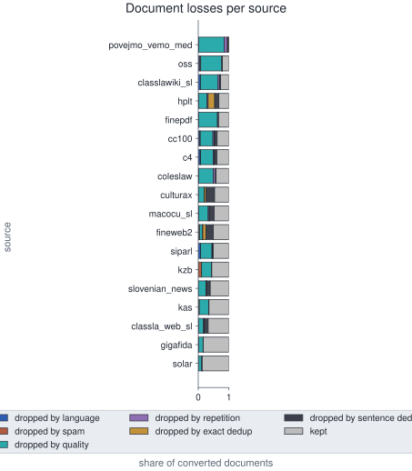

# Curation filter thresholds — Slovenian

## TL;DR

- **Hypothesis**: open — whether settings chosen per source let each content filter drop mostly what it targets, and mostly bad text, on a draw held back from tuning.
- **Next**: the baseline is restated from the rebuilt corpus, which clears every volume target; set up the three routes and tune their thresholds on the earlier audit's verdicts.

## Hypothesis

- **Builds on**: the curation-quality experiment (curation-quality-slovenian) found that every content filter drops mostly text worth keeping. It also found that how well a filter decides swings with the source. It measured the pipeline without changing it, and left the repair to this experiment.
- **Statement**: Once each source takes its own route through the content filters, with retuned thresholds, each filter mostly drops the text it is built to catch. The spam, quality and repetition filters then also mostly drop bad text, on a fresh draw held back from tuning.
- **Rationale**: the earlier audit points to settings, not to the filters themselves.
  - **The filters sort in the right direction.** In the earlier audit, kept text beat dropped text at every content filter when the judge compared them in pairs. The filters are miscalibrated, not inverted.
  - **Their failures sit on particular sources.** The spam filter drops mostly real spam on the raw web crawls and mostly clean prose on curated sources. The quality and repetition filters decide at about a coin flip on the medical and academic sources.
  - **The causes are known and fixable.** Parliamentary rebuttals hit a spam term, and patient leaflets repeat dosage lines by design. Gopher's thresholds were tuned on English web text, not on Slovene curated prose.
- **Predictions**: every clause is read on the fresh draw, judged only after the thresholds are frozen. A rate is read pooled over sources, and on each source the filter still runs on with at least 20 judged drops. Each filter is judged on its own target ([D1]): the language filter on non-Slovene text, the spam filter on spam, the quality filter on ill-formed text, the repetition filter on repeated furniture.
  - **H1 — The language filter drops text that is not Slovene**: confirmed if at least 0.6 of its drops are judged not Slovene, pooled and on every source; refuted if any rate falls below 0.5 — the filter would be removing Slovene text.
  - **H2 — The spam filter drops spam**: confirmed if at least 0.6 of its drops are judged adult or spam, pooled and on every source it runs on; refuted if any rate falls below 0.5 — routing and the repaired term list would not have fixed it.
  - **H3 — The quality filter drops ill-formed text**: confirmed if at least 0.6 of its drops score coherence 2 or lower or are labelled garbage, pooled and on every source; refuted if any rate falls below 0.5 — its floors would still misread Slovene prose.
  - **H4 — The repetition filter drops repeated furniture**: confirmed if at least 0.6 of its drops are labelled boilerplate or garbage, pooled and on every source; refuted if any rate falls below 0.5 — its limits would still catch text that repeats by design.
  - **H5 — The spam, quality and repetition filters drop bad text**: confirmed if each one's drop precision at the lenient bar is at least 0.6, pooled and on every source it runs on; refuted if any falls below 0.5 — a filter could hit its target and still discard usable text.
  - **Verdict rule**: confirmed when all five clauses hold; refuted when any clause is refuted; inconclusive otherwise.
  - **Read beside the clauses, not as clauses**: the share of bad text among kept documents per stage; retention per source, with the medical, scientific, legal and parliamentary sources called out; the corpus total against KPI 3 and the medicine and science totals against KPI 4 ([D4]); per-domain counts at every stage from the document-level domain classifier of the planned KPI coverage experiment, once it exists.
- **Outcome**: open

## Design

- **Inputs**: the curated corpus rebuilt under each candidate route, the earlier audit's judged sample and hand labels for tuning, and a fresh draw for validation, described in `## Datasets`.
- **Method / factors**: one tuning pass on old evidence, one validation pass on new evidence.
  - Restate the earlier audit's per-source baseline from the rebuilt corpus, since five sources were counted twice there.
  - Give each source one of three routes through the content filters, a starting point taken from the earlier audit's per-source numbers.
  - Tune the thresholds of each route against the earlier judge verdicts and hand labels.
  - Freeze the thresholds, rebuild the corpus, and draw a fresh sample under a new seed.
  - Judge the fresh draw with the earlier rubric, then with a judge from another model family.
  - Factors: the route each source takes, the Gopher quality and repetition floors, the language-identification threshold, and the spam thresholds on the repaired spam signal. The dedup stages stay fixed.
- **Metrics**: primary target precision per content filter and source, and drop precision at the lenient bar for the spam, quality and repetition filters. Secondary: residual bad rate, retention per source, corpus and domain totals in estimated tokens, and Cohen's κ between the two judges. Each metric is defined in `experiments/GLOSSARY.md`.
- **Protocol**: analysis-only for the judging: `analysis.py` recomputes every table from the corpus counts and the verdict files. Each corpus rebuild logs to MLflow under `slm4ie/data/curate`. Findings rest on one judge run, and its agreement with the hand labels is read on that same run ([D3]).
- **Compute**: one local machine with 40 cores; each candidate rebuild reruns only the units whose effective settings changed.
- **People**: the project lead chooses the second judge and reviews the routes; no new hand labels are planned.
- **Data access**: four licence-restricted sources (culturax, gigafida, kas, solar) are used internally, as in the earlier audit.
- **External dependency**: Anthropic's Claude for the first judge; a second judge from another model family through OpenRouter, the model chosen by the project lead.

## Datasets

- **Baseline corpus**: the shared pretraining corpus rebuilt with the pipeline as it stands on main ([D5], the baseline build), one row per source with its domain, kind, licence and size before and after curation. Built 2026-10-05 to 2026-10-08 at commit 2ece205 from 18 Slovene sources. [Sources of the baseline corpus, before and after curation](tables/dataset-corpus-statistics.csv)

## Methods

## Decisions

### D1 — Judge each filter on what it is built to catch, and the content filters also on bad text

- **Decision**: Each content filter has its own target. Language: the judge says the text is not Slovene. Spam: the judge flags it adult or spam. Quality: coherence 2 or lower, or garbage. Repetition: boilerplate or garbage. The spam, quality and repetition filters are also scored on bad text at the lenient bar. The language filter is not.
- **Why**: Whether a text is Slovene says nothing about its quality, so the language filter cannot be expected to drop bad text. The earlier audit's bar counted non-Slovene drops as bad text, mixing the two.
- **Alternatives**:
  - The earlier audit's single bar for every filter: it blends a filter's purpose with general quality, and hides which one fails.
- **History**:
  - 2026-10-05 first version, at record creation

### D2 — Count a filter as working at 0.6, and as failing below 0.5

- **Decision**: A clause is confirmed at a rate of at least 0.6, pooled and on every source with at least 20 judged drops. It is refuted below 0.5 on any of them.
- **Why**: 0.6 is the line below which the earlier audit called a filter wrong, and the earlier filters sat far below it. 0.8 would likely fail on the spam filter over web crawls even if routing fixes the curated sources.
- **Alternatives**:
  - 0.8, the earlier audit's confirm bar: too ambitious for the spam filter on web crawls.
- **History**:
  - 2026-10-05 first version, at record creation

### D3 — Tune on the old evidence, claim only on a fresh draw read by two judges

- **Decision**: Thresholds are tuned on the earlier audit's judge verdicts and 116 hand labels. Every claim rests on a fresh draw under a new seed, judged only after the thresholds freeze, and confirmed by a judge from another model family. The agreement gate is read on the judge run the findings use.
- **Why**: Thresholds fitted to one judge's verdicts on one sample stop being neutral evidence. The earlier audit read its gate on one run and its findings on another, which weakened every number it reported.
- **History**:
  - 2026-10-05 first version, at record creation; second judge through OpenRouter, model chosen later by the project lead

### D4 — Keep the corpus above the volume targets while tuning

- **Decision**: No setting may push the final corpus below KPI 3, more than 5B estimated tokens, or medicine or science below KPI 4, more than 500k estimated tokens each. Domains are read from source labels. Document-level domain counts from the planned KPI coverage experiment are added beside them once that classifier exists.
- **Why**: Tuning trades kept text against quality, and the project's corpus-size targets bound that trade. Source labels already cover the curated domain sources, so this experiment need not wait for the classifier.
- **History**:
  - 2026-10-05 first version, from the ordering agreed with the KPI coverage experiment

### D5 — Take the baseline from a fresh build of the shared corpus at main's settings

- **Decision**: The baseline is the shared corpus rebuilt with the pipeline as it stands on main: the repaired spam filter, the current source list, and no per-source routes. It is not the earlier audit's build.
- **Why**: The earlier build counted five sources twice and predates the spam repair. Two sources are now skipped as copies of others: parlamint_si inside siparl, legal_mc4 inside c4. Main's settings are no setting of this experiment, so they rebuild the shared corpus.
- **History**:
  - 2026-10-05 first version, after every unit of the on-disk corpus was found out of date

### D6 — Score every candidate setting on a full build of the pipeline

- **Decision**: Each candidate route and threshold set is a full pipeline build, written into this experiment's own data folder and never over the shared corpus.
- **Why**: Dedup across the corpus and the volume targets ([D4]) depend on what every source keeps. Only a full build shows both, so the whole pipeline runs for each candidate.
- **Alternatives**:
  - Rerun only the filters on the earlier audit's judged documents: fast, but blind to dedup and to corpus totals.
- **History**:
  - 2026-10-05 first version, at the project lead's call

## Findings

### F1 — Removing the double counting leaves each source's retention almost unchanged · minor

- **Summary**: Every source keeps within three points of the share it kept in the earlier audit's build, except the student-essay source solar.
- **Runs**: 6af9c1e7f8c942e08aeddef25666a9f2, the baseline rebuild under `slm4ie/data/curate`; `analysis.py` over its stage sentinels and the earlier audit's source funnel table.
- **Result**: 
- **Reading**: The earlier audit's per-source picture still holds as the starting point for tuning, since solar's rise only undoes the doubled converted count its old share was computed on.
- **History**:
  - 2026-10-08 first result, from the baseline rebuild ([D5])

### F2 — The quality filter still removes most of the curated domain text · minor

- **Summary**: The quality filter drops four in five of the medical source's documents, the largest loss of any source at any stage.
- **Runs**: 6af9c1e7f8c942e08aeddef25666a9f2, the baseline rebuild under `slm4ie/data/curate`; `analysis.py` over its stage sentinels and the statistics stage.
- **Result**: 
- **Reading**: The quality filter is the largest single loss on the curated domain sources, so the medical and academic route is where retuning its floors can win back the most text.
- **History**:
  - 2026-10-08 first result, from the baseline rebuild ([D5])

### F3 — The baseline corpus clears every volume target · minor

- **Summary**: About 14.8B estimated tokens remain, nearly three times the corpus target, and every domain clears the per-domain target.
- **Runs**: 6af9c1e7f8c942e08aeddef25666a9f2, the baseline rebuild under `slm4ie/data/curate`; `analysis.py` over the statistics stage.
- **Result**: [Estimated tokens per domain in the baseline corpus and in the earlier audit's build, against the KPI threshold each is held to](tables/curate-tokens-by-domain.csv)
- **Reading**: The volume rule that bounds tuning ([D4], the corpus and per-domain token floors) binds only on medicine, whose single source could lose about two thirds of what it keeps before falling under its floor.
- **History**:
  - 2026-10-08 first result, from the baseline rebuild ([D5])

## Verdict

## Reproduce
