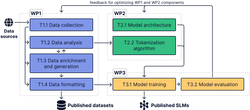

Projekt poteka v treh delovnih sklopih v dveh letih. WP1
pripravi podatke, WP2 zgradi model in njegov tokenizator, WP3 pa izvaja usposabljanje in evalvacijo, pri čemer se meritve iz WP3 vračajo neposredno v pripravo podatkov in arhitekturo, tako da ostajajo vsi trije sklopi odprti vse do konca.

<figure class="slm-figure" markdown>

<figcaption>Slika 1: Shema programa dela projekta.</figcaption>
</figure>

## WP1 — Pridobivanje in priprava podatkov

WP1 pretvarja surovo besedilo v podatke, iz katerih se lahko model uči. **T1.1 Zbiranje podatkov** zbira besedila v evropskih jezikih s poudarkom na slovanskih. **T1.2 Analiza podatkov** preverja njihovo kakovost ter prikazuje, kateri jeziki in področja so dobro pokriti in kje je pokritost slaba; ugotovitve služijo tudi kot vodilo za tokenizator v T2.2. **T1.3 Bogatenje in generiranje podatkov** zapolnjuje te vrzeli, pri čemer se izmenično usklajuje z analizo, dokler pokritost ni ustrezna. **T1.4 Formatiranje podatkov** oblikuje končne rezultate za predhodno usposabljanje (pretraining) in fino uglaševanje (fine-tuning) ter jih posreduje usposabljanju modela v T3.1. Urejeni nabori podatkov so objavljeni v odprti kodi.

## WP2 — Razvoj modelov

WP2 načrtuje model, v katerega se podatki stekajo. **T2.1 Arhitektura modela** sestavlja komponente, ki so najprimernejše za ekstrakcijo informacij, pri čemer se opira na zasnove, ki temeljijo izključno na kodirnikih (encoder-only) ali izključno na dekodirnikih (decoder-only). **T2.2 Algoritem tokenizacije** prilagaja način deljenja besedila na žetone (tokene) za morfološko bogate evropske jezike na podlagi analize v T1.2. Oboje prispeva k usposabljanju modela v T3.1.

## WP3 — Usposabljanje in evalvacija modelov

WP3 usposablja modele in jih preizkuša. **T3.1 Usposabljanje modela** združuje formatirane podatke iz T1.4 ter arhitekturo in tokenizator iz WP2. **T3.2 Evalvacija modela** primerja usposobljene modele z uveljavljenimi merili (benchmarki) ter tako z večjimi modeli kot z modeli podobne velikosti. Rezultati se vračajo v WP1 in WP2 (kot prikazuje povratna zanka na vrhu slike 1), kar omogoča sprotno izpopolnjevanje podatkov, arhitekture in tokenizatorja glede na pridobljene rezultate. Modeli, ki se izkažejo za ustrezne, so javno objavljeni.

## Rezultati in poročila (Deliverables)

Napredek projekta označujejo štiri poročila, in sicer dve v vsakem letu trajanja projekta. Med objavami poročil se pomembnejši rezultati objavljajo pod razdelkom [Novice](news/index.md), vsak
poskus pa se sproti beleži
[v repozitoriju](https://github.com/eriknovak/SLM4IE/blob/main/experiments/README.md).
